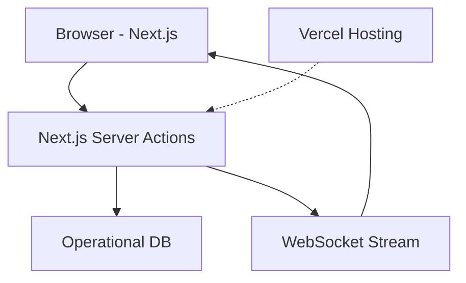

# Calebsons React/Next.js — Enterprise Dashboard

## Overview
A real-time enterprise dashboard with server actions, WebSockets, and a modular UI system.

## Tech Stack
- Next.js 14
- React
- ShadCN UI
- WebSockets
- TypeScript

## Features
- Real-time charts
- Role-based UI
- Server actions
- Responsive layout
- Modular components

## Architecture

## Setup
    npm install
    npm run dev

## Deployment
- Vercel

## Roadmap
- Add analytics engine
- Add multi-tenant dashboards
